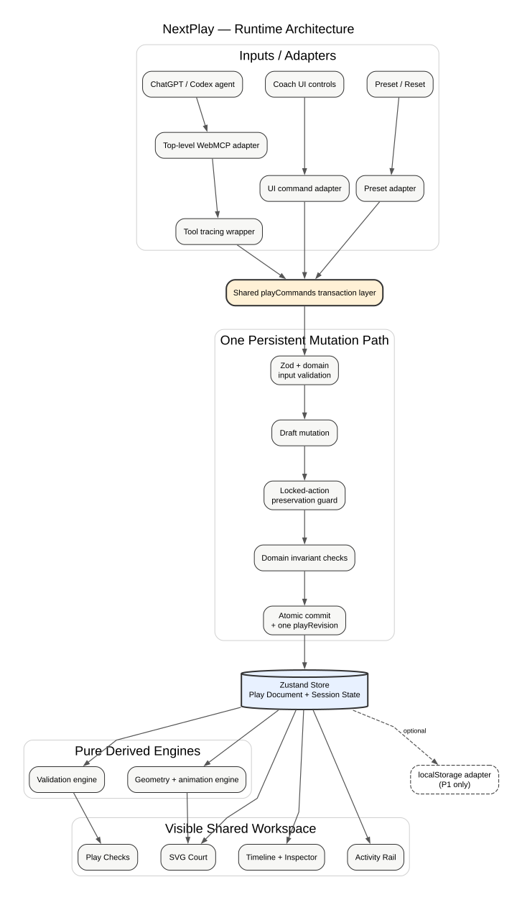

# NextPlay

NextPlay is a browser-native basketball tactics board built for the OpenAI WebMCP Challenge. A coach and an agent work on the same live, structured play: the agent can read, construct, validate, and animate it, while coach-locked actions remain a human authority boundary.

[Open the public NextPlay demo](https://next-play-lake.vercel.app)



## Why WebMCP

The collaboration depends on the agent operating the visible application state rather than producing prose or editing a hidden copy. NextPlay exposes a small WebMCP surface whose handlers use the same command layer as the coach UI. Each successful write is committed before the tool returns, increments the play revision exactly once, and appears immediately on the court, timeline, and activity rail.

The production tool surface is exactly:

1. `get_play_state`
2. `add_play_actions`
3. `validate_play`
4. `animate_play`
5. `update_play_action`

There is deliberately no agent tool for locking or unlocking. Only the coach UI can change an action lock, and agent updates to locked actions return `ACTION_LOCKED` without changing the revision.

## Golden demo

The initial screen is a sideline-out-of-bounds preset with five offensive players, five defenders, O1 holding the ball, a 4.2-second clock, and no actions.

Use the exact **First play** prompt shown in the application:

> Use this page’s tools to create a sideline out-of-bounds play that produces a right-corner three for O2. O5 should screen for O2, O4 should cut as a decoy, and the entire play must finish within 4.2 seconds. Read the current play first, add the actions, validate the result, and animate it.

Then use the normal coach controls to move O5’s screen destination to the right elbow, lock that screen, lock O2’s route, and set the clock to 2.0 seconds. Use the exact **Replan** prompt:

> I moved the screen, locked the screen and O2’s route, and shortened the clock to 2.0 seconds. Re-read the live play and retime only the unlocked actions so the play finishes within the new clock. Preserve every locked action, validate it, and animate it again.

The validator reports deterministic structural facts only: clock containment, incompatible same-player overlap, possession order, required inbound pass and shot, valid references, and lock preservation. NextPlay does not predict tactical quality, scoring probability, or whether a real team will execute the play successfully. Its playback is an animated tactical diagram, not a physics simulation.

## Local development

Requirements: Node.js 24 and npm 11, matching the verified release environment.

```bash
npm ci
npm run dev
```

Open the local URL printed by Vite. In a browser without `document.modelContext`, NextPlay honestly reports manual mode and all coach controls remain usable.

Run the complete quality gate with:

```bash
npm run verify
```

The repository also exposes `typecheck`, `lint`, `test`, `test:unit`, `test:integration`, and `build` scripts.

## Testing with the built-in browser

1. Open the public deployment in a fresh built-in-browser tab.
2. Confirm the status reports exactly five site tools and the pristine SLOB preset is visible.
3. Run the First play prompt through the page tools in this order: read, add, validate, animate.
4. Make the coach edit and two locks through the UI, then change the clock to 2.0 seconds.
5. Run the Replan prompt through the page tools: read, update the unlocked pass, update the unlocked shot, validate, animate.
6. Confirm both locked action snapshots are unchanged, the final validation is 7/7, playback ends within 2.0 seconds, and Reset restores the pristine preset.

## Architecture

All persistent changes—whether initiated by the coach UI, a WebMCP tool, or reset—flow through `playCommands` and one atomic transaction layer before reaching the Zustand store. Persistent play content lives under `document`; selection, validation, animation, WebMCP availability, and activity history live under `session`. Pure domain and engine modules own schemas, geometry, validation, and animation derivation.

Repository map:

- `src/application/` — shared commands and atomic transaction boundary
- `src/domain/` — play types, schemas, zones, and deterministic preset
- `src/engine/` — validation, animation, and court geometry
- `src/state/` — document/session store
- `src/ui/` — court, timeline, inspector, activity, validation, and playback UI
- `src/webmcp/` — five-tool schemas, adapters, registration, and result shaping
- `tests/` — unit and integration product contracts
- `docs/` — design, golden-demo, phase, and release records

## Current scope and limitations

NextPlay intentionally ships one desktop-first half-court SLOB scenario. Defenders are static during playback. There is no persistence, backend, authentication, sharing, direct endpoint dragging, tactical optimizer, or success prediction. These limits keep the demonstration focused on deterministic human-agent collaboration.

## License

[MIT](LICENSE)
