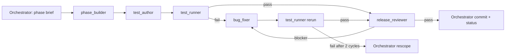

# NextPlay — Competition Build Plan

**Planning timestamp:** Wednesday, September 2, 2026, approximately 12:00 p.m. PT
**Official deadline:** Thursday, September 3, 2026 at 1:00 p.m. PT
**Internal submission target:** Thursday, September 3, 2026 at 11:45 a.m. PT
**Feature freeze:** Wednesday, September 2, 2026 at 10:30 p.m. PT

## 1. Delivery strategy

Build a sequence of independently demonstrable vertical slices. Each phase ends with an observable product behavior, an automated gate, and a commit. Do not begin the next phase merely because files exist; begin it only after the current acceptance criteria pass.

The critical path is:

```text
Deployed shell
→ deterministic state/commands
→ visible court action
→ real WebMCP read/write
→ validation + animation
→ coach lock/edit
→ agent replan
→ reliability + submission
```

The project has two non-negotiable external gates:

- **Gate A:** a real site-tool call visibly adds an action on the deployed court.
- **Gate B:** after a coach edit/lock/clock change, a real site-tool call preserves locked actions and repairs only unlocked timing.

All other work is subordinate.

## 2. Multi-agent phase loop

Run every implementation phase through this sequence:



Rules:

- Only one write-capable role works on shared phase files at a time.
- The test author follows the builder, rather than writing simultaneously against changing interfaces.
- The test runner never edits source.
- The bug fixer never weakens tests.
- The orchestrator owns commits, phase status, and scope decisions.
- Limit a phase to two fix cycles. After that, simplify or cut the unstable behavior.

A rendered version is available in `docs/diagrams/codex-pipeline.svg`.

## 3. Phase 0 — Repository, toolchain, and live deployment

**Time box:** 45 minutes
**Suggested window:** 12:00–12:45 p.m. Wednesday
**Goal:** A clean repository deploys a visible app shell from the first commit.

### Build

1. Create Git repository and default branch.
2. Scaffold Vite + React + TypeScript.
3. Enable strict TypeScript.
4. Add ESLint and Vitest.
5. Add minimal CSS reset and app shell.
6. Add MIT license.
7. Add deployment configuration for Vercel or Netlify.
8. Deploy immediately.
9. Add `AGENTS.md`, `.codex/`, and `docs/` planning package.
10. Add required package scripts.

### Initial repository files

```text
package.json
vite.config.ts
tsconfig*.json
eslint.config.js
src/main.tsx
src/App.tsx
src/styles.css
AGENTS.md
docs/DESIGN.md
docs/BUILD_PLAN.md
```

### Tests and checks

- `npm run typecheck`
- `npm run lint`
- `npm run test`
- `npm run build`
- Load the public URL in a fresh browser.

### Acceptance criteria

- Public HTTPS URL loads without authentication.
- Page shows the product label, a court placeholder, and “Manual mode” or honest WebMCP status.
- Production build has no console-blocking error.
- `npm run verify` exists and passes.

### Stop condition

Do not build product logic until the public deployment works. Deployment problems discovered at the end of the sprint are unacceptable.

## 4. Phase 1 — Domain model, preset, store, and transaction commands

**Time box:** 1 hour 45 minutes
**Suggested window:** 12:45–2:30 p.m.
**Goal:** The application can load and mutate a deterministic SLOB play through one command path.

### Build

1. Define player/action/zone/scenario types.
2. Define normalized zone coordinates.
3. Define Zod action schemas and type-specific refinement.
4. Create the golden SLOB preset.
5. Split Zustand state into `document` and `session`.
6. Add the transaction wrapper.
7. Implement:
   - `loadDemoPreset`
   - `resetDemo`
   - `setClock`
   - `addActions`
   - `updateAction`
   - `setActionLocked` as UI-only
8. Add structured command result and error types.
9. Add activity event creation.
10. Ensure one successful content command equals one revision increment.

### Primary files

```text
src/domain/types.ts
src/domain/zones.ts
src/domain/schemas.ts
src/domain/presets.ts
src/domain/invariants.ts
src/application/commands.ts
src/application/transaction.ts
src/application/results.ts
src/state/playStore.ts
src/state/selectors.ts
```

### Test-author requirements

- Golden preset is deterministic.
- Valid six-action batch commits atomically and increments once.
- Invalid item makes the whole batch fail.
- Stale expected revision fails with no mutation.
- Coach clock change increments once.
- Locking increments once.
- Agent update of a locked action fails and does not increment.
- A pre-existing locked action cannot be changed indirectly.
- Session-only selection/activity does not change play revision.

### Acceptance criteria

- A development control can add the golden actions through `playCommands.addActions`.
- The store contains correct preset players and actions.
- Revision and activity logs match the command sequence.
- All phase tests pass.

### Cut line

Do not implement persistence, undo/redo, player locks, or generalized command middleware.

## 5. Phase 2 — SVG court, action rendering, timeline, and inspector

**Time box:** 1 hour 45 minutes
**Suggested window:** 2:30–4:15 p.m.
**Goal:** A hard-coded or command-added play is immediately understandable and editable.

### Build

1. Draw half-court SVG with stable viewBox.
2. Render O1–O5 and X1–X5 markers.
3. Render action paths:
   - solid movement
   - dotted/wavy dribble approximation
   - screen bar
   - dashed pass
   - curved shot
4. Build one timeline row per offensive player.
5. Position action blocks from start/duration.
6. Add selected action state.
7. Build inspector controls for:
   - start
   - duration
   - destination zone when relevant
   - label
   - coach-only lock toggle
8. Add editable header clock.
9. Add reset control.

### Primary files

```text
src/ui/AppShell.tsx
src/ui/Header.tsx
src/ui/court/Court.tsx
src/ui/court/CourtPlayer.tsx
src/ui/court/ActionPath.tsx
src/ui/timeline/Timeline.tsx
src/ui/timeline/TimelineAction.tsx
src/ui/inspector/ActionInspector.tsx
src/ui/styles.css
src/engine/geometry/paths.ts
```

### Test-author requirements

- Preset markers render with stable accessible/test IDs.
- Timeline and court reflect the same action collection.
- Selecting an action opens correct inspector data.
- Inspector changes dispatch commands rather than direct store mutation.
- Lock state appears in timeline and inspector.
- Clock edit produces the expected command/activity behavior.
- Reset restores the exact preset.

### Acceptance criteria

- Loading a six-action fixture produces a legible court and timeline.
- The coach can change A3 destination through the inspector and lock A3/A4.
- No direct SVG drag is required yet.
- Refreshing/reloading does not produce a broken layout.

### Cut line

Do not add drag handles, responsive mobile redesign, complex timeline dragging, or visual themes.

## 6. Phase 3 — WebMCP vertical slice: read and add

**Time box:** 1 hour 30 minutes
**Suggested window:** 4:15–5:45 p.m.
**Goal:** A real agent can discover the page tools, read the live preset, and visibly add structured actions.

This is the most important phase. Stop all polish work until it passes on the deployed URL.

### Build

1. Add TypeScript declarations for `document.modelContext`.
2. Implement feature detection and status.
3. Implement cleanup-safe top-level registration.
4. Implement tracing wrapper.
5. Register:
   - `get_play_state`
   - `add_play_actions`
6. Parse all tool input with Zod.
7. Route handlers into the command layer.
8. Return concise revision/change/validation summaries.
9. Ensure UI updates before tool success resolves.
10. Deploy.

### Primary files

```text
src/webmcp/modelContext.d.ts
src/webmcp/toolNames.ts
src/webmcp/jsonSchemas.ts
src/webmcp/registerTools.ts
src/webmcp/tracing.ts
src/application/agentSnapshot.ts
src/ui/BrowserStatus.tsx
src/ui/ActivityRail.tsx
```

### Test-author requirements

- Fake model context captures exactly two phase tools.
- Tool names/descriptions/schemas are valid and closed.
- `get_play_state` is read-only and does not increment revision.
- `add_play_actions` delegates to commands and commits before returning.
- Invalid raw tool input returns a descriptive failure.
- Cleanup aborts registrations.
- Development remount does not leave duplicate active tools.

### External acceptance gate A

On the deployed URL in ChatGPT’s in-app browser:

1. Inspect available site tools.
2. Ask the agent to read the play.
3. Ask it to add one simple move.
4. Confirm the court and timeline change visibly.
5. Reset.
6. Run the first golden prompt.

**Gate A passes only when a real site-tool call visibly changes the deployed court.**

### Failure response

If Gate A has not passed by 5:45 p.m.:

- freeze all UI expansion
- keep only `get_play_state` and `add_play_actions`
- inspect registration lifecycle, schema compatibility, and top-level execution
- do not proceed to P1 or aesthetic polish

## 7. Phase 4 — Deterministic validation and animation

**Time box:** 2 hours
**Suggested window:** 5:45–7:45 p.m.
**Goal:** The first golden play validates honestly and animates clearly.

### Build validation

1. Reference validation.
2. Clock overflow.
3. Same-player incompatible overlap.
4. Inbound pass existence.
5. Shot existence.
6. Possession event timeline.
7. Invalid pass/shot possession.
8. Validation report UI.
9. `validate_play` tool.

### Build animation

1. Pure `positionAtTime` helper.
2. Straight/quadratic movement interpolation.
3. Ball ownership before/after passes.
4. Ball interpolation during pass.
5. Curved shot to basket.
6. Screen bar during active screen.
7. `requestAnimationFrame` controller.
8. play/pause/reset/seek-to-zero basics.
9. `animate_play` tool.

### Primary files

```text
src/engine/validation/index.ts
src/engine/validation/clock.ts
src/engine/validation/overlap.ts
src/engine/validation/possession.ts
src/engine/animation/positionAtTime.ts
src/engine/animation/ballAtTime.ts
src/engine/animation/controller.ts
src/ui/ValidationPanel.tsx
src/webmcp/registerTools.ts
```

### Test-author requirements

- A6 ending at 2.15 on a 2.0 clock yields exact `CLOCK_OVERFLOW` data.
- Pass completion at the same timestamp as shot start transfers possession first.
- O2 shooting before receiving produces `INVALID_SHOT_POSSESSION`.
- Validator does not change play revision.
- Animation start does not change play revision.
- Position and ball helpers are deterministic at boundary times.
- Tool adapters are read-only/ephemeral as designed.

### Acceptance criteria

- First golden action set passes all required structural checks at 4.2 seconds.
- Changing clock to 2.0 produces one clear clock conflict.
- Animation visibly shows movement, pass, and shot.
- No page refresh or content mutation occurs during playback.

### Cut line

Static defenders are acceptable. Do not build defensive reactions or physics.

## 8. Phase 5 — Human lock-and-replan vertical slice

**Time box:** 1 hour 45 minutes
**Suggested window:** 7:45–9:30 p.m.
**Goal:** Complete the competition-defining second turn.

### Build

1. Register `update_play_action`.
2. Include locks, exact destination, modifier, and revision in agent snapshot.
3. Enforce direct locked-target rejection.
4. Enforce indirect locked-snapshot preservation in transaction layer.
5. Show failed lock attempts in activity.
6. Show coach edits and locks in activity.
7. Make `SYSTEM Preserved 2 locked actions` visible after successful agent revision.
8. Deploy.

### Test-author requirements

- `update_play_action` accepts allowed patches and rejects unknown fields.
- Locked A3/A4 remain deeply equal after A5/A6 updates.
- Agent cannot change lock state through the patch schema.
- Stale revision error tells agent to read again.
- Coach edits are returned by the next `get_play_state`.
- Activity sequence distinguishes coach, agent, and system.

### External acceptance gate B

On the deployed URL:

1. Reset to pristine preset.
2. Run first golden prompt.
3. Change A3 destination to right elbow.
4. Lock A3 and A4.
5. Set clock to 2.0.
6. Confirm the visible clock overflow.
7. Run the second golden prompt.
8. Confirm only unlocked actions changed.
9. Confirm final validation passes.
10. Confirm animation completes.

**Gate B passes only if locked actions are preserved by actual site-tool execution.**

### Cut line

Do not register the remaining three tools unless Gate B has already passed multiple times.

## 9. Phase 6 — Activity rail, visual polish, and optional direct drag

**Time box:** 1 hour
**Suggested window:** 9:30–10:30 p.m.
**Goal:** Make the already-working flow easy to understand on video.

### Build in priority order

1. Clarify spacing and visual hierarchy.
2. Make locks and actor labels obvious.
3. Add compact expandable tool input/result detail.
4. Add exact example prompt copy buttons.
5. Add clean manual-mode state.
6. Improve action-entry transition.
7. Only if time remains: direct SVG destination dragging for the selected action.

### Acceptance criteria

- At 1280×720, court, activity, checks, and timeline are visible enough for a screen recording.
- A viewer can understand coach versus agent actions without narration.
- No polish change breaks Gate A or Gate B.

### Feature freeze at 10:30 p.m.

After this point, no new tools, interactions, persistence, or architecture changes.

## 10. Phase 7 — Integration hardening and release candidate

**Time box:** 2 hours 30 minutes
**Suggested window:** 10:30 p.m.–1:00 a.m.
**Goal:** Produce a known-good deployed release candidate.

### Work

1. Run all unit/integration tests.
2. Run typecheck, lint, build.
3. Inspect production bundle in fresh browser.
4. Run Golden Flow A and B at least twice.
5. Fix only P0 blockers.
6. Remove any unstable P1 feature.
7. Confirm reset and manual fallback.
8. Tag or record release candidate commit and URL.
9. Keep prior known-good deployment available.

### Required commands

```bash
npm run verify
npm run test -- --runInBand   # only if supported/needed
npm run build
```

Optional:

```bash
npm run test:e2e
```

### Release candidate acceptance

- All automated gates pass.
- No unexpected console errors.
- Both flows pass twice on deployed build.
- Activity and validation text are accurate.
- Repository is public-ready and licensed.

## 11. Phase 8 — Rest, final acceptance, video, and submission

**Suggested schedule:**

- **1:00–6:30 a.m.:** protected sleep/rest; do not make unreviewed changes.
- **6:30–8:30 a.m.:** five consecutive fresh-session golden runs; blocker fixes only.
- **8:30–10:30 a.m.:** record and edit demo video; capture screenshots.
- **10:30–11:15 a.m.:** finalize README and Devpost text.
- **11:15–11:45 a.m.:** final links, public permissions, and submission.
- **11:45 a.m.:** internal submission target.
- **1:00 p.m.:** official hard deadline; do not plan to use this buffer.

### Five-run acceptance table

| Run | Fresh session | First flow | Coach edit/locks | Second flow | Reset | Notes |
|---:|---|---|---|---|---|---|
| 1 | [ ] | [ ] | [ ] | [ ] | [ ] | |
| 2 | [ ] | [ ] | [ ] | [ ] | [ ] | |
| 3 | [ ] | [ ] | [ ] | [ ] | [ ] | |
| 4 | [ ] | [ ] | [ ] | [ ] | [ ] | |
| 5 | [ ] | [ ] | [ ] | [ ] | [ ] | |

### Submission package

- public live URL
- public repository
- MIT license
- README with exact test instructions
- project description
- screenshots
- public video under three minutes
- model/browser instructions for site tools
- final sanity check from a logged-out/incognito browser where applicable

## 12. Phase priority and fallback matrix

| If time is running out after… | Keep | Cut |
|---|---|---|
| Phase 1 | preset, commands, revision, locks | activity detail, persistence |
| Phase 2 | court, timeline, inspector | drag, responsive polish |
| Phase 3 | get/add tools | all extra tools |
| Phase 4 | clock/possession validation, basic animation | warnings, defender motion |
| Phase 5 | read/update/locks/replan | remove/set-defense/set-position tools |
| Phase 6 | clarity and reset | decorative motion, export/share |
| Phase 7 | known-good release | any unstable P1 feature |

## 13. Definition of each phase gate

A phase is **PASS** only when:

1. The observable acceptance behavior works.
2. New tests exist for the phase’s critical behavior.
3. `test_runner` reports the required commands passing.
4. `release_reviewer` reports no blocker.
5. The orchestrator updates `docs/PHASE_STATUS.md`.
6. The orchestrator commits the accepted state.

A phase is **FAIL** when behavior or tests fail.

A phase is **BLOCKED** only for a concrete external reason, such as unavailable site-tool support or deployment outage. “More work is needed” is not a blocked state.

## 14. Recommended first Codex orchestration prompt

```text
Work as the primary orchestrator for NextPlay. Read AGENTS.md,
docs/DESIGN.md, docs/BUILD_PLAN.md, docs/PHASE_STATUS.md, and the Phase 0 brief.
Execute only Phase 0.

Use the configured agents in this exact order:
1. phase_builder
2. test_author
3. test_runner
4. bug_fixer only if tests fail, followed by test_runner again
5. release_reviewer

Wait for each role before starting the next write-capable role. Do not let subagents
commit. Review the final diff, update PHASE_STATUS.md, and commit only if the phase
gate passes. Report the exact live deployment URL and verification commands.
```

For later phases, replace `Phase 0` with the current phase and point to its brief.
