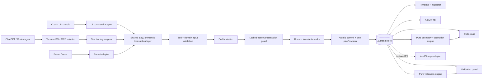

# NextPlay — Technical Design Document

**Status:** Build-ready competition design
**Date:** September 2, 2026
**Deadline:** September 3, 2026 at 1:00 p.m. PT
**Target:** WebMCP Challenge submission
**Primary implementation:** Static React + TypeScript web application

## 1. Executive summary

NextPlay is a browser-native basketball tactics board where a coach and an AI agent operate on the same live play.

The agent can read the current formation, clock, actions, locks, and revision through page-registered WebMCP tools. It can then add structured basketball actions, update unlocked actions, run deterministic validation, and start the visible animation. The coach can directly edit the play through the normal interface, lock decisions that must be preserved, and change constraints. On the next turn, the agent re-reads the current page and adapts only the unlocked parts.

The competition-defining moment is:

> The agent creates and animates a play; the coach edits and locks part of it and shortens the clock; the agent re-reads those exact live changes and repairs the remaining play without overwriting the coach.

This design intentionally optimizes for a reliable three-minute demonstration. It is not a broad coaching platform.

## 2. Problem statement

Digital play designers already let coaches draw, animate, organize, and share plays. The unresolved workflow is the repeated translation between tactical intent and an editable visual artifact:

1. A coach has an intended outcome.
2. The intention must become precise positions, cuts, screens, passes, shots, and timings.
3. The first draft is almost never final.
4. The coach wants to preserve some decisions and change others.
5. A generic browser agent does not naturally understand unsaved board state, semantic basketball actions, or authority boundaries.

The bottleneck is not access to a digital whiteboard. It is preserving human judgment while an agent accelerates structured construction and revision.

## 3. Why WebMCP is essential

The critical state exists in the current browser page:

- unsaved player and action positions
- current clock
- current timeline
- selected action
- coach modifications
- action locks
- validation state
- current play revision

A pixel-only agent would need to infer the court, drag small handles, and guess which changes are authoritative. WebMCP lets the page expose narrow semantic operations such as `get_play_state`, `add_play_actions`, and `update_play_action` while the coach sees the same board change.

The second agent turn proves necessity: it depends on page-local edits made after the original prompt.

## 4. Goals and non-goals

### 4.1 Goals

- Make the product understandable in ten seconds.
- Demonstrate real page-registered WebMCP tools.
- Support one polished SLOB scenario.
- Make all agent writes visible on court, timeline, activity rail, and validation panel.
- Preserve human authority through coach-only locks.
- Use deterministic validation and animation.
- Make the golden demo repeatable in fresh sessions.
- Remain manually usable without WebMCP.

### 4.2 Non-goals

- Predicting whether a play will score.
- Claiming tactical optimality.
- Simulating realistic basketball physics.
- Defensive AI or film analysis.
- Team, roster, account, or collaboration management.
- Real NBA data or branding.
- A built-in chatbot or embedded model call.
- Multiple polished formations or full-court support.
- Production-grade persistence or backend services.

## 5. Success criteria

### 5.1 Product success

A judge can complete both flows:

**Construction:** preset → agent read → six actions added → validation → animation.

**Revision:** coach edits screen → locks two actions → shortens clock → validation error → agent re-read → unlocked timing repaired → final validation → animation.

### 5.2 Technical success

- One shared command path owns all persistent mutations.
- Locked action snapshots cannot change through agent tools.
- Batch writes are atomic.
- Content revisions are monotonic and meaningful.
- Read, validation, and animation do not mutate play content.
- Tool results are concise and verifiable.
- The deployed URL passes five consecutive fresh-session tests.

### 5.3 Submission success

- Public app, public repository, project description, and public demo video are ready.
- Demo video is under three minutes and begins with the product working.
- Submission is made before the final hour.

## 6. Golden scenario

### 6.1 Initial state

```text
Scenario: Sideline out of bounds
Clock: 4.2 seconds
Defense: Man-to-man
Primary target: Right-corner three for O2
Ball: O1
```

Starting offense:

| Player | Role | Zone |
|---|---|---|
| O1 | inbounder | inbound_right |
| O2 | shooter | right_block |
| O3 | weak-side wing | left_corner |
| O4 | decoy cutter | left_elbow |
| O5 | screener | right_elbow |

Defenders use a deterministic man-to-man preset.

### 6.2 First action set

The expected play is structurally similar to:

| ID | Time | Action |
|---|---:|---|
| A1 | 0.00–0.75 | O3 clears to left wing |
| A2 | 0.00–0.85 | O4 cuts to rim as decoy |
| A3 | 0.15–0.95 | O5 sets pin-down for O2 |
| A4 | 0.30–1.35 | O2 flares to right corner |
| A5 | 1.40–1.70 | O1 passes to O2 |
| A6 | 1.72–2.15 | O2 shoots |

The exact play is not evaluated for tactical novelty. It must be plausible, legible, and structurally valid.

### 6.3 Human intervention

The coach:

1. selects A3
2. changes its destination to `right_elbow`
3. locks A3
4. locks A4
5. changes the clock to 2.0 seconds

Validation must now identify A6 as a clock overflow.

### 6.4 Agent repair

The agent re-reads the state and updates only A5/A6 timing. A3 and A4 must remain deeply equal to their locked snapshots.

## 7. Architecture overview

### 7.1 Runtime architecture



A rendered version is available in `docs/diagrams/runtime-architecture.svg`.

### 7.2 Architectural principle

Human UI and WebMCP tools are adapters, not separate applications. Both call the same command layer. This prevents differences in validation, lock enforcement, revision behavior, and activity logging.

### 7.3 Recommended module boundaries

- `domain/`: types, semantic zones, presets, action schemas, invariants.
- `application/`: commands, transaction wrapper, result envelopes, agent snapshots.
- `engine/validation/`: pure structural validation.
- `engine/animation/`: pure position/ball interpolation and path geometry.
- `state/`: Zustand composition and selectors.
- `webmcp/`: tool schemas, registration, tracing, browser types.
- `ui/`: React components and normal coach controls.
- `tests/`: unit, command integration, WebMCP contract, optional browser tests.

## 8. State model

The source specification uses one canonical `PlayState`. For implementation reliability, split it into content and session state so revision semantics remain clean.

### 8.1 Persistent play document

```typescript
interface PlayDocument {
  id: string;
  playRevision: number;
  title: string;
  scenario: "sideline_out_of_bounds" | "baseline_out_of_bounds" | "half_court";
  clockSeconds: number;
  defenseScheme: "man" | "switch_all" | "two_three_zone" | "drop";
  targetOutcome?: string;
  ballOwnerId: OffenseId;
  players: Player[];
  actions: PlayAction[];
}
```

### 8.2 Transient session state

```typescript
interface PlaySessionState {
  selectedActionId?: string;
  validation: ValidationReport;
  animation: {
    status: "idle" | "playing" | "paused";
    currentSecond: number;
    speed: 0.5 | 1 | 1.5 | 2;
    loop: boolean;
  };
  webmcp: {
    available: boolean;
    registeredToolNames: string[];
  };
  activity: ActivityEvent[];
  nextActivitySequence: number;
}
```

### 8.3 Player model

```typescript
interface Player {
  id: PlayerId;
  team: "offense" | "defense";
  role: string;
  startingPosition: Point;
  startingZone: ZoneId;
  matchupId?: PlayerId;
  lastModifiedBy: "coach" | "agent" | "system";
}
```

**Design refinement:** omit `Player.locked` in the MVP. The human-agent authority boundary is action locking. Adding two lock concepts creates ambiguity and unnecessary enforcement paths.

### 8.4 Action model

```typescript
interface PlayAction {
  id: string;
  type: "move" | "dribble" | "screen" | "pass" | "shot";
  actorId: OffenseId;
  targetPlayerId?: OffenseId;
  destinationZone?: ZoneId;
  destinationPosition?: Point;
  startSecond: number;
  durationSecond: number;
  pathStyle?: PathStyle;
  screenType?: ScreenType;
  label?: string;
  locked: boolean;
  lockOwner?: "coach";
  createdBy: "coach" | "agent";
  lastModifiedBy: "coach" | "agent";
  createdAtRevision: number;
  updatedAtRevision: number;
}
```

When a coach drags or manually sets an exact point, store both `destinationPosition` and the nearest semantic `destinationZone`. Agent-created actions normally specify the zone only.

## 9. Revision and concurrency model

### 9.1 Revision definition

`playRevision` represents the version of persistent play content, not UI activity.

It increments once after a successful content command. It does not increment for:

- `get_play_state`
- `validate_play`
- `animate_play`
- selection
- hover
- activity logging

This refinement avoids stale-state false positives caused by animation or validation.

### 9.2 Optimistic concurrency

Write tools may receive `expectedRevision`.

```typescript
if (
  input.expectedRevision !== undefined &&
  input.expectedRevision !== document.playRevision
) {
  return {
    ok: false,
    code: "STALE_PLAY_STATE",
    currentRevision: document.playRevision,
    message: "The play changed. Read the current play before editing."
  };
}
```

The field remains optional to minimize friction, but the golden prompts should encourage reading first.

### 9.3 Atomic transaction wrapper

```typescript
function executeContentCommand<TResult>(
  metadata: CommandMetadata,
  expectedRevision: number | undefined,
  mutate: (draft: PlayDocument) => TResult
): CommandResult<TResult> {
  const before = getDocument();
  assertExpectedRevision(before, expectedRevision);
  const lockedBefore = snapshotLockedActions(before.actions);
  const draft = structuredClone(before);

  const result = mutate(draft);

  assertLockedActionsPreserved(lockedBefore, draft.actions, metadata.actor);
  assertDocumentReferences(draft);

  draft.playRevision = before.playRevision + 1;
  stampUpdatedRevisions(draft, result);
  commit(draft);
  refreshValidationWithoutRevision();
  logCompletedActivity(metadata, before.playRevision, draft.playRevision, result);

  return success(draft.playRevision, result);
}
```

A production implementation may use Immer/Zustand drafts, but the semantics must match this transaction.

## 10. Command layer

### 10.1 Content commands

- `loadDemoPreset`
- `resetDemo`
- `setClock`
- `setDefenseScheme`
- `setStartingPositions`
- `addActions`
- `updateAction`
- `removeActions`
- `setActionLocked` — UI-only

### 10.2 Session commands

- `selectAction`
- `runValidation`
- `startAnimation`
- `pauseAnimation`
- `seekAnimation`
- `setWebMcpStatus`
- `appendActivity`

### 10.3 Metadata

```typescript
interface CommandMetadata {
  actor: "coach" | "agent" | "system";
  channel: "ui" | "webmcp" | "preset";
  operation: string;
  toolName?: string;
}
```

### 10.4 Result envelope

```typescript
type CommandResult<T> =
  | {
      ok: true;
      revision: number;
      data: T;
      validation: { errors: number; warnings: number };
    }
  | {
      ok: false;
      revision: number;
      code: CommandErrorCode;
      message: string;
      details?: unknown;
    };
```

All tool-visible errors must be descriptive enough for the agent to correct itself.

## 11. WebMCP tool design

### 11.1 Submission tool surface

Register only five P0 tools until the golden flow is stable:

| Tool | Kind | Purpose |
|---|---|---|
| `get_play_state` | read | Read live document state and locks |
| `add_play_actions` | write | Atomically add a structured action batch |
| `update_play_action` | write | Patch one unlocked action |
| `validate_play` | read | Return deterministic checks |
| `animate_play` | ephemeral | Start visible playback |

The original specification also defines starting-position, defense, and removal tools. Keep their domain commands and schemas design-ready, but do not register them before the core demo is reliable. A smaller tool surface improves selection reliability and saves implementation/test time.

### 11.2 Registration rules

- Top-level JavaScript registration only.
- Feature-detect `document.modelContext?.registerTool`.
- Use an `AbortController` for cleanup.
- Prevent duplicate or stale registrations during React development remounts.
- Keep schemas closed with `additionalProperties: false`.
- Parse every execute input through Zod.
- Update visible state before success returns.
- Record started/completed/failed activity.

### 11.3 Tool adapter shape

```typescript
export async function registerBasketballTools(): Promise<() => void> {
  const modelContext = document.modelContext;
  if (typeof modelContext?.registerTool !== "function") {
    playCommands.setWebMcpStatus(false, []);
    return () => undefined;
  }

  const controller = new AbortController();
  const options = { signal: controller.signal };

  await modelContext.registerTool(
    {
      name: "get_play_state",
      description: "Read the live basketball play, including clock, positions, actions, locks, and revision.",
      inputSchema: GetPlayStateJsonSchema,
      annotations: { readOnlyHint: true },
      execute: async (rawInput) =>
        tracedTool("get_play_state", rawInput, () => {
          const input = GetPlayStateInput.parse(rawInput);
          return playCommands.getAgentSnapshot(input.includeActionDetails ?? true);
        })
    },
    options
  );

  // Register remaining P0 tools with the same adapter pattern.

  playCommands.setWebMcpStatus(true, P0_TOOL_NAMES);
  return () => controller.abort();
}
```

### 11.4 Concise agent snapshot

The read result should omit large UI/session details and return only useful current state:

```json
{
  "revision": 9,
  "scenario": "sideline_out_of_bounds",
  "clockSeconds": 2,
  "defenseScheme": "man",
  "ballOwnerId": "O1",
  "targetOutcome": "Right-corner three for O2",
  "players": [
    { "id": "O5", "role": "screener", "zone": "right_elbow" }
  ],
  "actions": [
    {
      "id": "A3",
      "type": "screen",
      "actorId": "O5",
      "targetPlayerId": "O2",
      "destinationZone": "right_elbow",
      "startSecond": 0.15,
      "durationSecond": 0.8,
      "locked": true,
      "lastModifiedBy": "coach"
    }
  ],
  "validation": { "errors": 1, "warnings": 0 }
}
```

## 12. Validation engine

Validation is a pure function:

```typescript
validatePlay(document: PlayDocument): ValidationReport
```

### 12.1 Error checks

- `CLOCK_OVERFLOW`
- `PLAYER_ACTION_OVERLAP`
- `INVALID_PASS_POSSESSION`
- `INVALID_SHOT_POSSESSION`
- `MISSING_INBOUND_PASS`
- `MISSING_SHOT`
- `INVALID_ACTION_REFERENCE`
- `LOCK_VIOLATION` for rejected mutation activity

### 12.2 Warning checks

- `LATE_SHOT`
- `IDLE_OFFENSIVE_PLAYER`
- `CROWDED_DESTINATION`
- `LONG_PASS`

Warnings never block animation.

### 12.3 Stable possession event ordering

Build explicit timeline events. At equal time:

1. pass completion
2. shot start
3. pass start
4. other starts/endings

Start with the document’s `ballOwnerId`. A pass is valid only if the actor owns the ball at pass start. Possession transfers at pass completion. A shot is valid only if the actor owns the ball at shot start.

### 12.4 Overlap policy

For one offensive actor, these pairs cannot overlap:

- move with move
- move with dribble
- move with screen hold
- dribble with screen
- pass with another pass
- shot with pass/dribble/move

A screen’s arrival movement and hold may be represented as one action for the MVP. The validator treats the full interval as occupied.

### 12.5 Honest presentation

Display counts and factual messages:

```text
6/7 execution checks passed
O2's shot ends at 2.15s, after the 2.00s clock.
```

Do not display a “play quality” percentage.

## 13. Geometry and animation

### 13.1 Coordinate system

Use semantic zones mapped to normalized 0–100 coordinates. The SVG uses a stable `viewBox="0 0 100 100"` or a proportional court viewBox with mapping helpers.

### 13.2 Position derivation

For each player and time `t`:

1. Start from the player’s starting position.
2. Sort movement-bearing actions by time.
3. Complete all actions ending before `t`.
4. Interpolate the active action if one exists.
5. Hold the last completed destination otherwise.

Movement-bearing actions are `move`, `dribble`, and `screen`.

### 13.3 Paths

- P0: straight and simple quadratic Bézier paths.
- Path style affects control-point selection, not domain state transitions.
- Pass: dashed line and interpolated ball.
- Shot: curved ball path toward rim.
- Screen: screener movement plus perpendicular bar during active interval.

### 13.4 Animation loop

Use `requestAnimationFrame`. Keep animation time in session state and derive visuals from document state. Starting, pausing, or completing animation must not change `playRevision`.

### 13.5 Deterministic testability

Extract pure helpers:

- `positionAtTime(document, playerId, t)`
- `ballStateAtTime(document, t)`
- `pathForAction(document, action)`
- `animationDuration(document)`

Do not unit-test `requestAnimationFrame` timing itself; test derived positions and state transitions.

## 14. UI design

### 14.1 Desktop layout

```text
Header: scenario | clock | defense | WebMCP status | reset | play/pause
Main left: interactive SVG court
Main right: agent activity + play checks
Bottom: player timeline
Context panel: selected-action inspector
```

### 14.2 P0 editing surface

The reliable P0 interaction is the inspector:

- select action from timeline/court
- edit destination with semantic zone control
- edit start/duration numerically
- lock/unlock through coach-only UI

Direct drag is added only after both golden flows work. This protects the demo from pointer-coordinate bugs while still giving the coach direct control.

### 14.3 Activity rail

Each event includes:

```typescript
interface ActivityEvent {
  id: string;
  sequence: number;
  timestamp: string;
  actor: "coach" | "agent" | "system";
  channel: "ui" | "webmcp" | "preset";
  operation: string;
  summary: string;
  revisionBefore: number;
  revisionAfter: number;
  status: "started" | "completed" | "failed";
  input?: unknown;
  result?: unknown;
}
```

Tool tracing should automatically create started/completed/failed entries.

### 14.4 WebMCP status

- `● Agent tools available` only after successful registration.
- `○ Manual mode` when the API is absent or registration fails.
- The rest of the app remains functional.

## 15. Reliability and security

### 15.1 Trust boundaries

Untrusted inputs:

- WebMCP tool arguments
- localStorage payloads if enabled
- URL state if added later

Validate and narrow all of them before commands execute.

### 15.2 Lock defense in depth

1. No lock/unlock tool exists.
2. `updateAction` rejects a directly locked target.
3. Transaction wrapper compares all pre-existing locked snapshots before commit.
4. Tests deep-compare locked actions.
5. Activity log records rejected violations.

### 15.3 React registration lifecycle

Development Strict Mode may mount/cleanup/mount effects. Registration code must handle async cleanup:

```typescript
useEffect(() => {
  let cancelled = false;
  let cleanup = () => undefined;

  void registerBasketballTools().then((fn) => {
    if (cancelled) fn();
    else cleanup = fn;
  });

  return () => {
    cancelled = true;
    cleanup();
  };
}, []);
```

### 15.4 Persistence decision

Persistence is P1. It can make a competition demo less deterministic by restoring stale state. Ship reset and fresh preset first. If localStorage is added:

- persist document only
- validate versioned payload
- clear on reset
- never persist active animation or activity noise

## 16. Testing strategy

### 16.1 Unit tests

- zone lookup and nearest-zone mapping
- action input parsing
- path/position interpolation
- possession event ordering
- validation rules

### 16.2 Command integration tests

- valid add batch commits once
- invalid add batch commits nothing
- stale revision rejects before mutation
- action lock blocks agent update
- indirect locked-action mutation is caught
- failed command leaves revision unchanged
- coach lock and clock edit update state/activity correctly

### 16.3 WebMCP contract tests

Provide a fake `document.modelContext` and capture registrations. Assert:

- P0 names and count
- schemas and annotations
- cleanup signal
- handlers parse input
- handlers call command layer
- state is committed before success returns
- error envelopes remain concise and actionable

### 16.4 UI integration tests

- preset renders
- selecting action opens inspector
- lock state appears in timeline and inspector
- changing clock updates validation
- reset restores the exact preset
- manual mode message is honest

### 16.5 Optional browser smoke

Playwright can inject a fake model context, call captured tool execute handlers, and assert visible court/timeline changes. This does not replace real ChatGPT testing but catches adapter-to-UI regressions.

### 16.6 Real agent acceptance

Run the deployed golden flow five times in a fresh ChatGPT in-app browser session. Record pass/fail and exact failure mode in `docs/PHASE_STATUS.md`.

## 17. Repository structure

See `docs/REPOSITORY_STRUCTURE.md` for the exact tree. The core principle is a small, layered static app rather than a backend-heavy architecture.

## 18. Deployment

- Deploy the shell immediately to Vercel or Netlify.
- Keep `main` or a release branch continuously deployable.
- No auth, server secret, or runtime API dependency.
- Verify HTTPS, asset paths, refresh behavior, and a fresh browser session.
- Keep the previous known-good deployment until the release candidate is accepted.

## 19. Key architecture decisions

| ID | Decision | Rationale |
|---|---|---|
| ADR-001 | Static Vite React app | Lowest deployment and backend risk |
| ADR-002 | SVG court | Direct DOM interaction, scalable paths, simple animation |
| ADR-003 | Shared command layer | Prevent UI/WebMCP behavior drift |
| ADR-004 | Five P0 tools | Better reliability and less implementation scope |
| ADR-005 | Action locks only | Clear human authority boundary |
| ADR-006 | Split document/session state | Correct revision and stale-state semantics |
| ADR-007 | One revision per content command | Predictable optimistic concurrency |
| ADR-008 | Inspector before drag | Reliable direct edit for deadline |
| ADR-009 | Deterministic validation/animation | Honest claims and repeatable demo |
| ADR-010 | No embedded LLM | WebMCP agent is the intelligence |
| ADR-011 | Persistence deferred | Prevent stale demo state |
| ADR-012 | Sequential write agents | Avoid multi-agent file conflicts |

## 20. Risks and mitigations

| Risk | Impact | Mitigation |
|---|---|---|
| Site tools do not register | Submission fails | Test `get_play_state` + `add_play_actions` on deployed URL before polish |
| Too many features | Core flow unfinished | Five-tool P0 and hard feature freeze |
| Locked action overwritten indirectly | Collaboration claim invalid | Transaction snapshot guard + tests |
| Revision changes during animation | Agent gets false stale error | Split document/session state |
| Possession check disagrees at equal timestamp | False validation error | Explicit event priority |
| React remount duplicates tools | Unreliable tool list | Abort cleanup + idempotent registration tests |
| Local state contaminates demo | Judge sees wrong state | Defer persistence; prominent reset |
| Direct drag consumes time | Deadline slip | Inspector control is P0; drag P1 |
| Agent produces invalid action payload | Demo stalls | Narrow schema, Zod, descriptive errors, tested prompt |
| Last-minute regression | Submission blocker | Feature freeze, known-good deploy, five-run acceptance |

## 21. Open questions with recommended answers

1. **Should all eight tools ship?**
   Recommended: no. Ship five P0 tools. Add the other three only if both golden flows have already passed repeatedly.

2. **Should screen movement require SVG dragging?**
   Recommended: no for P0. Use an inspector zone control; add dragging only after feature freeze criteria are met early.

3. **Should validation be stored in the document?**
   Recommended: no. It is derived session state and must not increment play revision.

4. **Should the app persist automatically?**
   Recommended: defer. Competition reliability is more important than reload persistence.

5. **Should agents work in parallel on code?**
   Recommended: only on isolated, independent worktrees. The phase builder, test author, runner, and fixer pipeline should be sequential for shared files.

## 22. Release definition

The release candidate is accepted only when every checkbox in `docs/GOLDEN_DEMO.md` passes, `npm run verify` passes, the deployed URL succeeds five times in fresh sessions, and a public video/repository/submission package is ready.

## 23. References

- Source product specification supplied for this project: `Pasted markdown.md`.
- OpenAI WebMCP Challenge: https://openai.com/webmcp-challenge/
- OpenAI site tools / WebMCP guidance: https://learn.chatgpt.com/docs/webmcp
- Codex AGENTS.md guidance: https://learn.chatgpt.com/docs/agent-configuration/agents-md
- Codex subagents: https://learn.chatgpt.com/docs/agent-configuration/subagents
- Codex worktrees: https://learn.chatgpt.com/docs/environments/git-worktrees
